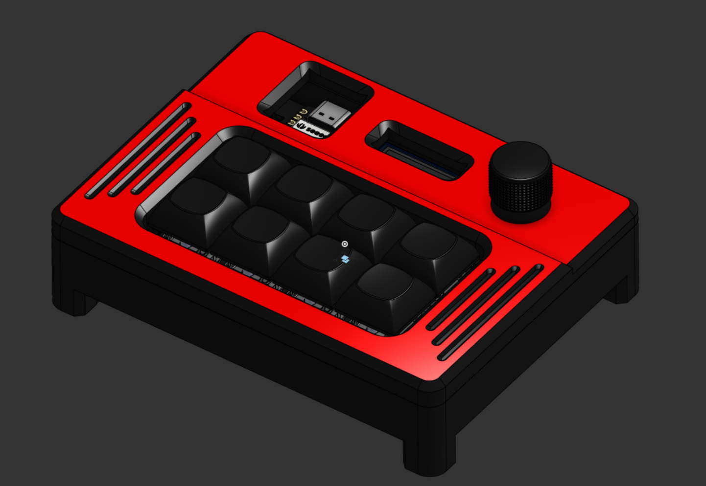
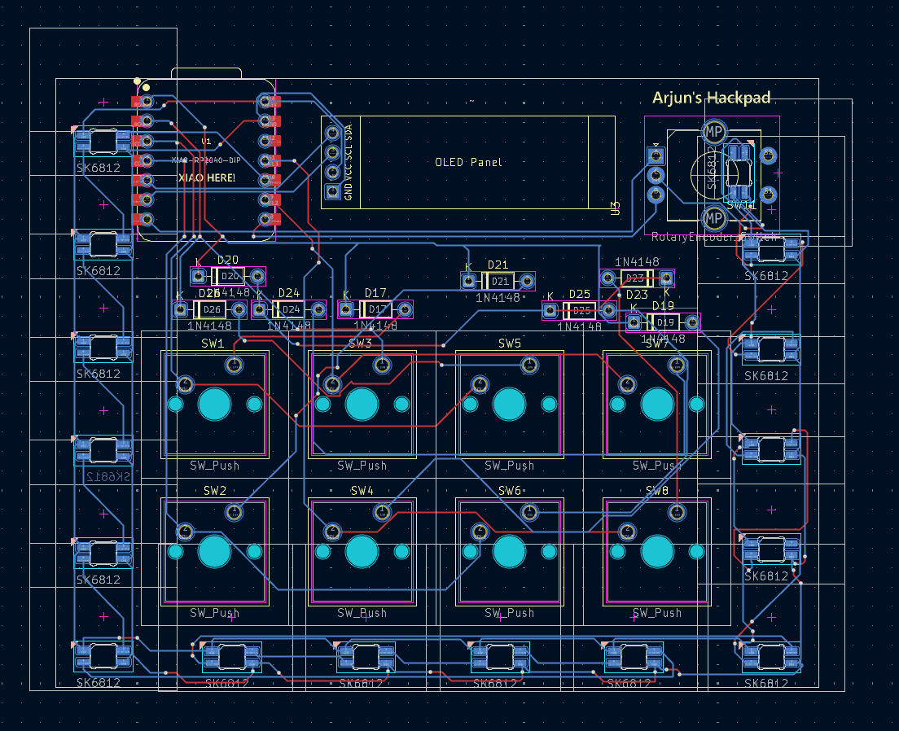
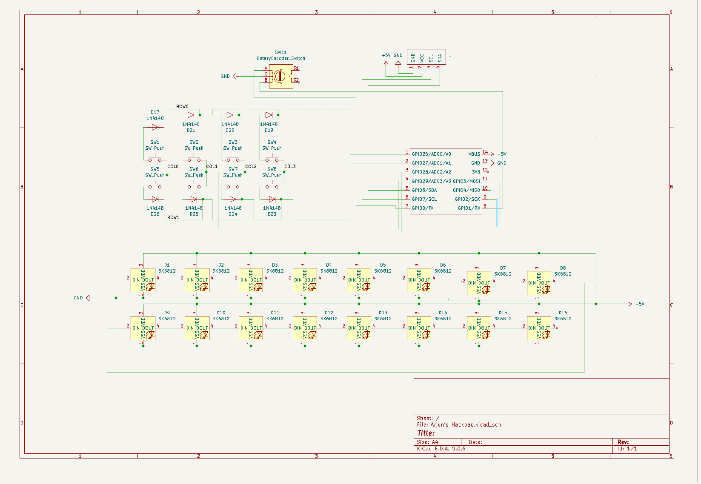

# Arjun's Hackpad

Arjun's Hackpad is an 8-key macropad with a rotary encoder, OLED display, and underglow RGB lighting. It uses custom QMK firmware with advanced features like RGB mode cycling and a toggleable encoder with 4 different modes.

## Features

* 8-key layout (2 rows × 4 columns)
* OLED Display showing encoder mode and RGB status
* EC11 Rotary encoder with 4 switchable modes (Volume, Brightness, Media, Scroll)
* 16x SK6812 MINI-E RGB LEDs (2 per key) for vibrant underglow
* Custom QMK firmware with advanced RGB and encoder control
* Two-piece 3D printed case with 5-degree tilt

## CAD Model



The case consists of two 3D printed parts held together with M3 hardware:
* **Top piece** - Contains 4 heatset inserts for mounting
* **Bottom piece** - Screws pass through bottom into top inserts
* Assembly uses 4x M3×16mm screws and 4x M3×5×4mm heatset inserts

## PCB



**PCB Specifications:**
* Dimensions: 78.72mm × 98.51mm
* 2-layer design
* Matrix wired as 2 rows × 4 columns with COL2ROW diode direction
* Seeed XIAO RP2040 microcontroller

### Schematic



The design uses a standard keyboard matrix with diodes. RGB LEDs are chained on GPIO4, OLED uses I2C on GPIO6/GPIO7, and the rotary encoder connects to GPIO0/GPIO1.

## Firmware

This hackpad uses **QMK firmware.**

### Key Layout:
```
[RGB Cycle] [Enc Toggle] [Play/Pause] [Next Track]
[   Copy  ] [   Paste  ] [   Undo   ] [   Redo   ]
```

### Features:
* **RGB Cycle (Key 1)**: Cycles through the 10 RGB animation modes
* **Encoder Toggle (Key 2)**: Switches encoder between 4 modes:
  1. Volume Up/Down
  2. Brightness Up/Down
  3. Media Next/Previous
  4. Scroll Up/Down
* **Media Controls**: Play/Pause and Next Track
* **Editing Shortcuts**: Copy, Paste, Undo, Redo
* **OLED Display**: Shows current encoder mode and RGB status


## BOM

Here's everything you need to build this hackpad:

* 1x Seeed XIAO RP2040
* 8x MX-Style switches
* 8x White blank DSA keycaps
* 8x 1N4148 DO-35 Diodes
* 16x SK6812 MINI-E RGB LEDs
* 1x 0.91" 128x32 OLED Display
* 1x EC11 Rotary Encoder
* 4x M3×16mm screws
* 4x M3×5×4mm heatset inserts
* 1x Custom PCB
* 1x 3D printed case

## Production Files

All manufacturing files are included in the `production/` folder:
* `gerbers.zip` - PCB manufacturing files
* `firmware.hex` - Compiled QMK firmware
* `Top.step` - 3D printable top part
* `Bottom.step` - 3D printable bottom part

## Assembly Instructions

1. **Print the case parts** (Top and Bottom)
2. **Install heatset inserts** into the 4 mounting holes in the top piece
3. **Solder components** to the PCB in this order:
   - Diodes (watch polarity!)
   - RGB LEDs (SK6812 MINI-E - watch orientation!)
   - OLED display
   - Rotary encoder
   - XIAO RP2040 (last)
4. **Flash firmware** to the XIAO RP2040
5. **Install switches** into the PCB
6. **Add keycaps** to switches
7. **Mount PCB** into bottom case
8. **Attach top case** using 4x M3×16mm screws through bottom into heatset inserts
